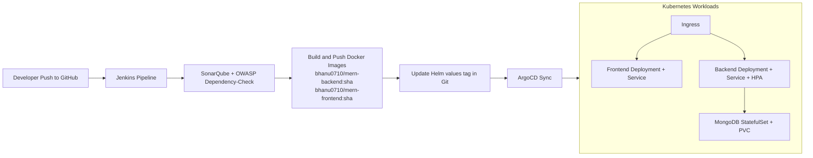

# Three-Tier MERN on AWS EKS with GitOps CI/CD

I built this project to show that I can take a MERN app from code to production-style deployment on Kubernetes.
I wanted one repo that covers application code, containerization, infrastructure, CI quality checks, and GitOps delivery.

## What I built

- I built a React frontend (Vite) and served it through NGINX
- I built a Node.js/Express backend with MongoDB integration
- I deployed all tiers using Kubernetes Deployments, Services, Ingress, and HPA
- I packaged deployment using a Helm chart
- I set up ArgoCD to sync cluster state from Git
- I added Jenkins CI with SonarQube and OWASP Dependency-Check quality gates
- I added Terraform templates to provision an AWS EKS baseline

## Architecture

- **Frontend**: React (Vite) served by NGINX
- **Backend**: Node.js + Express REST API
- **Database**: MongoDB (`StatefulSet` + `PVC`)
- **Platform**: Kubernetes on AWS EKS
- **Delivery**: Docker multi-stage builds, Helm, ArgoCD
- **CI Quality Gates**: SonarQube analysis + OWASP Dependency-Check

### Flow



## Repo layout

```text
mern-eks-cicd/
├── app/
│   ├── frontend/          # React (Vite)
│   ├── backend/           # Node/Express API
│   └── database/          # MongoDB init/notes
├── docker/
│   ├── frontend.Dockerfile
│   └── backend.Dockerfile
├── kubernetes/            # Plain manifests (good for learning/debugging)
├── helm/
│   └── mern-app/          # Helm chart used by ArgoCD
├── argocd/
│   └── application.yaml
├── jenkins/
│   └── Jenkinsfile
├── terraform/             # EKS + VPC provisioning
├── sonarqube/
│   └── sonar-project.properties
└── README.md
```

## Run locally (without Kubernetes)

### Prerequisites
- Node.js 20+
- Docker (optional)

### Backend

```bash
cd app/backend
cp .env.example .env
npm ci
npm run dev
```

### Frontend

```bash
cd app/frontend
cp .env.example .env
npm ci
npm run dev
```

I use `VITE_API_BASE_URL` in the frontend to point to the backend API.

## Build Docker images

```bash
docker build -f docker/backend.Dockerfile -t mern-backend:local .
docker build -f docker/frontend.Dockerfile -t mern-frontend:local .
```

## Deploy with Kubernetes manifests

When I deploy directly with manifests, I apply them in this order:

```bash
kubectl apply -f kubernetes/namespace.yaml
kubectl apply -f kubernetes/mongodb-statefulset.yaml
kubectl apply -f kubernetes/backend-deployment.yaml -f kubernetes/backend-service.yaml
kubectl apply -f kubernetes/frontend-deployment.yaml -f kubernetes/frontend-service.yaml
kubectl apply -f kubernetes/hpa.yaml
kubectl apply -f kubernetes/ingress.yaml
```

I keep manifest image tags pinned to `stable` (not `latest`) in:
- `kubernetes/backend-deployment.yaml`
- `kubernetes/frontend-deployment.yaml`

For CI-based manifest deployment, I update those tags to the commit SHA before `kubectl apply`.

I added a helper script for that:

```bash
./scripts/set-image-tag.sh <short-sha>
# example:
./scripts/set-image-tag.sh a1b2c3d
```

## Deploy with Helm (recommended for GitOps)

```bash
helm upgrade --install mern helm/mern-app -n mern --create-namespace
```

## ArgoCD (GitOps)

- I install ArgoCD in the cluster.
- I update `argocd/application.yaml` (`repoURL`, branch, and host if needed).
- Then I apply:

```bash
kubectl apply -f argocd/application.yaml
```

## Jenkins CI/CD

My pipeline in `jenkins/Jenkinsfile` does this:

- Install, build, and test backend + frontend
- Run SonarQube scan (quality gate)
- Run OWASP Dependency-Check
- Build & push Docker images tagged with short Git SHA
- Update Helm image tags in `helm/mern-app/values.yaml` with the same Git SHA for GitOps promotion

Before running the pipeline, I configure the Jenkins credentials and environment variables referenced in the Jenkinsfile.

## Terraform (EKS)

I use `terraform/README.md` to provision:
- VPC
- EKS Cluster
- Managed node group(s)

## API endpoints

- `GET /api/health`
- `GET /api/todos`
- `POST /api/todos` with JSON `{ "text": "..." }`

